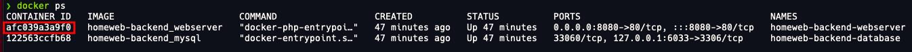

## FINAL PROJECT INFORMATICS ENGINEER BACHELOR'S DEGREE
<!-- TABLE OF CONTENTS -->
<details open="open">
  <summary><h2 style="display: inline-block">Table of Contents</h2></summary>
  <ol>
    <li>
      <a href="#about-the-project">About The Project</a>
      <ul>
        <li><a href="#built-with">Built With</a></li>
      </ul>
    </li>
    <li>
      <a href="#getting-started">Getting Started</a>
      <ul>
        <li><a href="#prerequisites">Prerequisites</a></li>
        <li><a href="#installation">Installation</a></li>
      </ul>
    </li>
    <li><a href="#usage">Usage</a></li>
    <li><a href="#contributing">Contributing</a></li>
    <li><a href="#license">License</a></li>
    <li><a href="#contact">Contact</a></li>
  </ol>
</details>


<!-- ABOUT THE PROJECT -->
### About The Project

Is a final project of UOC informatics engineering degree. About web development, this repository is for build docker environment to execute backend of project.

### Built With

* [PHP](https://www.php.net/)
* [Laravel](https://laravel.com/)
* [MySQL](https://www.mysql.com/)
* [Docker](https://www.docker.com/)
* [PHPStorm](https://www.jetbrains.com/es-es/phpstorm/)
* [Postman](https://www.postman.com/)


<!-- GETTING STARTED -->
### Getting Started

To get a local copy up and running follow these simple steps.

### Prerequisites

This is an example of how to list things you need to use the software and how to install them.
* docker
    * Mac OS X
        ```sh
        brew cask install docker
        ```
    * Linux
      ```sh
        sudo apt-get update
        sudo apt-get install docker-ce docker-ce-cli containerd.io
      ```
    * Windows
        - Download and execute [docker installer](https://desktop.docker.com/win/stable/Docker%20Desktop%20Installer.exe)

### Installation

1. Git clone
   ```sh
   cd ~/
   git clone https://github.com/imollm/homeweb-backend
   ```
2. Build and deploy
   ```sh
   cd ~/homeweb-backend
   docker-compose up -d
   ```
3. Execute init script
   ```sh
   docker ps
   ```
   Copy CONTAINER ID of homeweb-backend_webserver

    <p></p>

    ```sh
   docker exec -it <CONTAINER_ID> sh /var/www/html/deploy/init.sh
   ```
   
    This install dependencies and init database, with test data.

## Usage

1. Test with curl
    ```sh
    curl -I http://localhost:8080/homeweb-backend/public/api/properties/index
    HTTP/1.1 200 OK
    Date: Mon, 17 May 2021 15:11:59 GMT
    Server: Apache/2.4.38 (Debian)
    X-Powered-By: PHP/8.0.3
    Cache-Control: no-cache, private
    X-RateLimit-Limit: 60
    X-RateLimit-Remaining: 59
    Access-Control-Allow-Origin: *
    Content-Type: application/json
    ```
2. Test with Postman project

   * [Install Postman](https://www.postman.com/downloads/)

   * Download postman collection
    ```sh
      wget -O ~/tfg-docker-backend/postman.json https://www.getpostman.com/collections/c02928439a50147cc744
    ```

   4.3 Open with postman and test it.

<!-- CONTRIBUTING -->
## Contributing

Contributions are what make the open source community such an amazing place to be learn, inspire, and create. Any contributions you make are **greatly appreciated**.

1. Fork the Project
2. Create your Feature Branch (`git checkout -b feature/AmazingFeature`)
3. Commit your Changes (`git commit -m 'Add some AmazingFeature'`)
4. Push to the Branch (`git push origin feature/AmazingFeature`)
5. Open a Pull Request

<!-- LICENSE -->
## License

Distributed under the MIT License.

<!-- CONTACT -->
## Contact

Ivan Moll Moll - imollm@uoc.edu

Project Link: [https://github.com/imollm/homeweb-backend](https://github.com/imollm/homeweb-backend)
